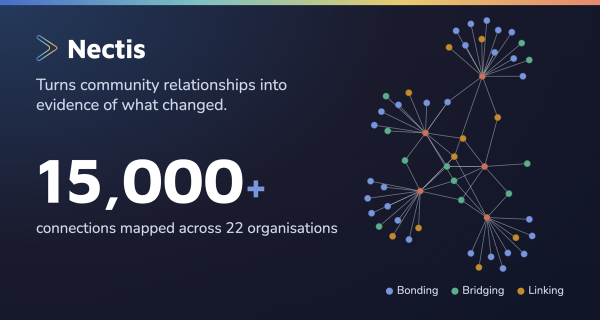
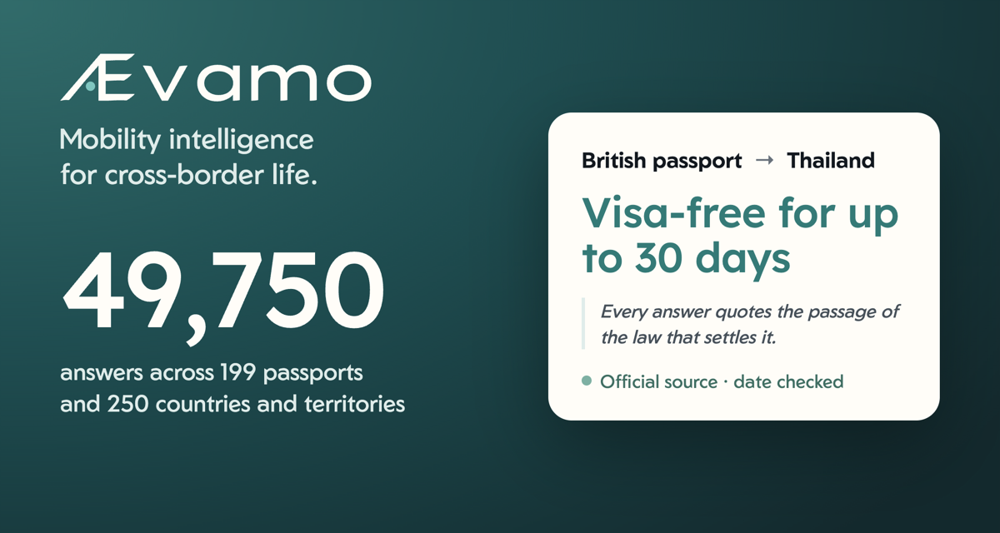

### Kerr Campbell

Founder. Product at Nectis, building Aevamo.

  
  

**[Nectis](https://nectis.io)** · Chief Product Officer 
Turns the relationships inside a community into hard evidence of what changed, so the people who fund the work can see it instead of taking it on faith.

**[Aevamo](https://aevamo.com)** · Founder 
Mobility intelligence for cross-border life: whether you can enter a country, how long you can stay, and how the days are counted, answered from the law itself.
- Entry rules for 199 passports into 250 countries and territories: 49,750 answers, drawn from more than 2,000 recorded rules.
- Every answer quotes the passage of the official law, decree or gazette it rests on, links to the source, and shows the date it was last checked.
- Where sources disagree, the official instrument wins and the disagreement is recorded rather than averaged away.
- Available on the web at [aevamo.com](https://aevamo.com), in a multiplatform app, and through an API and an MCP server.

Scottish-Spanish, living between Southeast Asia and Europe. I play guitar, camp in places I probably shouldn't, and sometimes disappear to my family's off-grid orchard in Portugal.

kerr.digitalsolver@gmail.com
